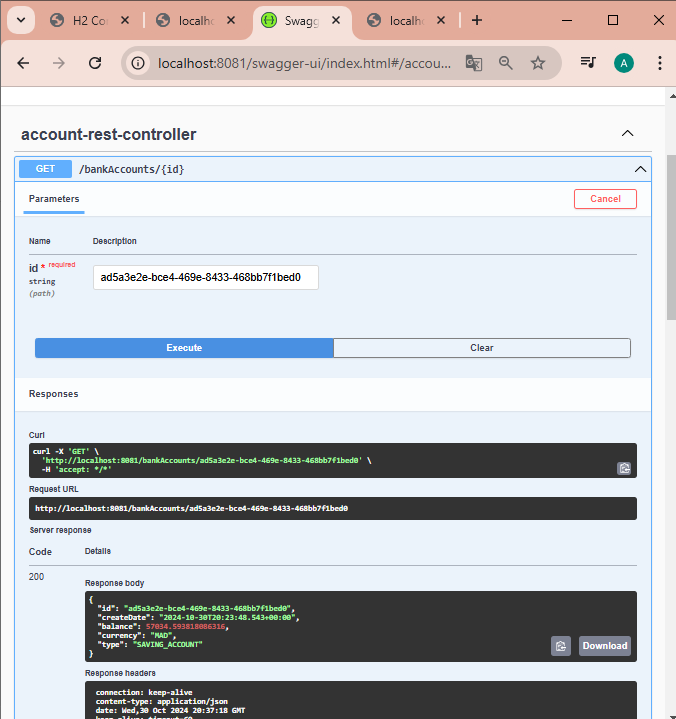

<h1>Développement d'un micro-service : BankAccountService</h1>

<h2>Base de données: h2-console</h2>

<h2>Services RESTful avec @RestController</h2>

<h3>Consulter la liste des compte</h3>

<h3>Consulter compte via son id</h3>

<h2>Postman : Outil pour tester et gérer les API</h2>

<h3>Consulter un compte</h3>

<h3>Post: Créer un compte</h3>

<h3>Put: Modifier un compte</h3>

<2>Swagger : Documentation et Tests des API RESTful</2>

<h2>Service RESTful avec Spring Data REST</h2> 

<h3>Configurer Spring Data REST : Ajouter les dépendances</h3>
 

<h3>Tester Spring Data REST</h3>

 

<h3>Projections dans Spring Data REST : Pour personnaliser les données exposées </h3>

